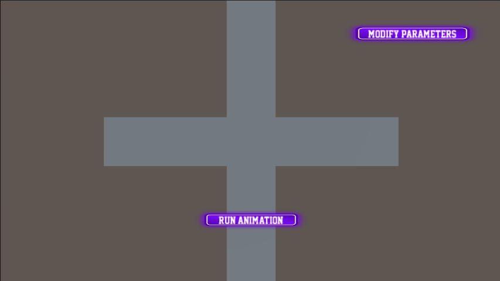
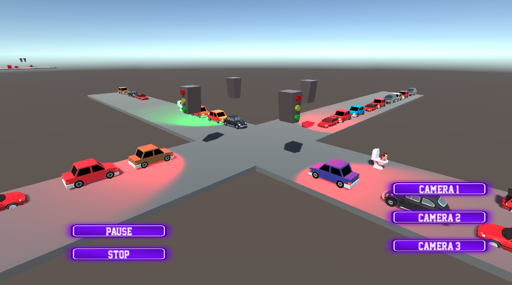

Here's an updated version of your README template with the necessary modifications and instructions on how to add screenshots:

---

# Repositorio de Reto TC2008B

## Description

_Include a brief description of your project here. Talk about what it does, its purpose, and what technologies it uses. This section should give someone new to your project a good idea of what it is about and the technology stack it uses._

## Prerequisites

Before you begin, ensure you have met the following requirements:

- Python 3.x installed
- Flask installed
- Unity (specify the version, if necessary) installed
- Jupyter Notebook or JupyterLab installed

## Installation

To install the project, follow these steps:

1. Clone the repo: `git clone https://github.com/jorgebustmonttec/reto-TC2008b-agentpy`
2. Navigate to the project directory: `cd reto-TC2008b-agentpy`
3. Install required Python libraries: `pip install -r requirements.txt`

## Usage

There are two ways to run the project:

### Running the Notebook Independently

1. Navigate to the root directory of the project.
2. Open Jupyter Notebook or JupyterLab: `jupyter notebook` or `jupyter lab`.
3. Navigate to the `.ipynb` file you wish to run. For this project, open `intersection-agents.ipynb`.
4. Run the notebook cells to visualize the model independently.

### Running the Project with Unity

1. **Start the Flask Server**:
   - Navigate to the root directory of the project
   - Run `python [stage]/serverstuff/pythonserver.py` to start the Flask server. This server will interact with the Unity application to run the model and visualize it.
2. **Run the Unity Project**:
   - Open Unity and load the project located inside the final/ folder, called `tiletest222NEW`
   - Once the Unity Editor is open, you'll be faced with a UI including a set of sliders, checkboxes, and a 'Send' button.
   - Adjust parameters as needed and click 'Send' to run the model in the background. The server will execute the model and return the data for visualization.
     
   - Once inside, press the 'run animation' Button to run the animation, or press 'modify parameters' to return.
     
   - Once the animation is running, buttons for camera positions and to stop and pause will apear.
     

### Folders and Versions

- The project contains three folders corresponding to different stages of the project: `avance 2`, `avance 3`, and `final`.
- Use the `final` folder for the most updated versions of the scripts and Unity project.

---
